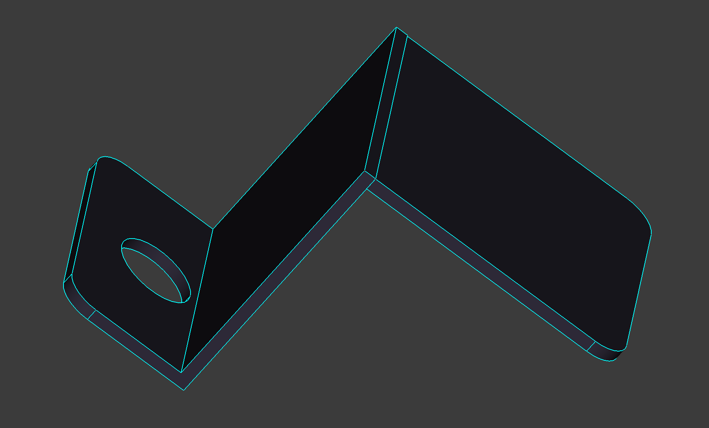
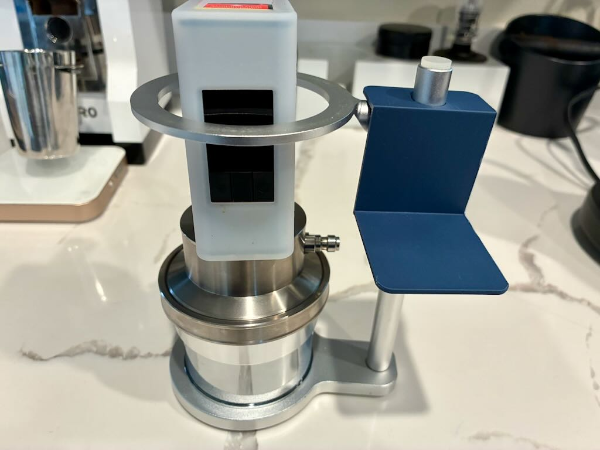
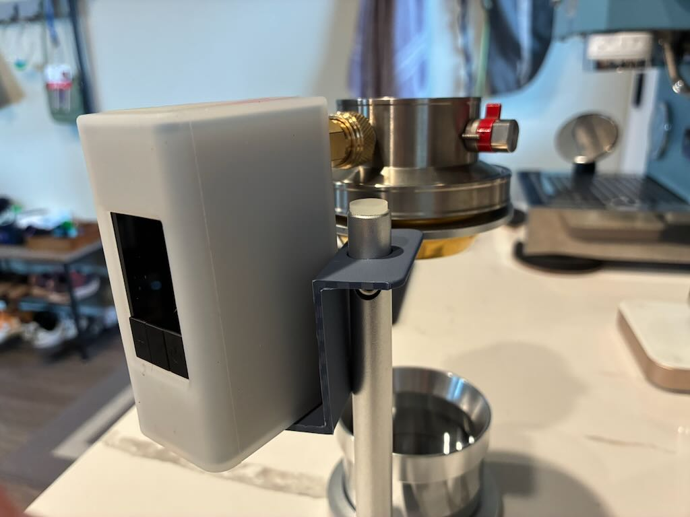

# Pneumatic Espresso Pump Holder (peph)

A 3D-printed bracket that holds a portable air pump alongside the [Gilka Pneumatic Espresso Machine](https://gilka-coffee-store.com/products/gilka-pneumatic-espresso-machine-1), keeping your setup tidy and hands-free during pulls.

## My Setup

A portable pneumatic espresso setup: the Gilka uses pressurized air to pull a shot, and the mini pump provides that pressure without requiring a bulky hand pump.

| Item | Vendor | Price | Description |
|------|--------|-------|-------------|
| [Gilka Pneumatic Espresso Machine](https://gilka-coffee-store.com/products/gilka-pneumatic-espresso-machine-1) | Gilka Coffee Store | $249 | Portable titanium espresso machine driven by pressurized air |
| [Mini Air Pump](https://www.aliexpress.us/item/3256811744264446.html) | AliExpress | $65 | Compact electric pump that pressurizes the Gilka for hands-free pulls |

## Downloads

| File | Description |
|------|-------------|
| [`peph.3mf`](peph.3mf) | Ready-to-print 3MF — open in your slicer and go |
| [`pneumatic-espresso-pump-holder.FCStd`](pneumatic-espresso-pump-holder.FCStd) | FreeCAD source file for modifications |

## Printing

- No supports needed
- Any material works (PETG recommended for heat resistance near espresso gear)
- Standard 0.2mm layer height, 20%+ infill

## License

[GNU GPL v3](LICENSE)
